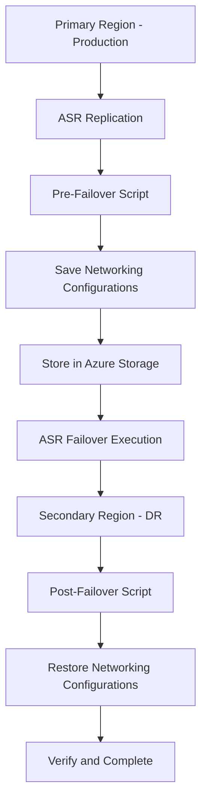

# Azure Site Recovery Integration Guide

## ASR Integration Overview

This guide provides step-by-step instructions for integrating the PowerShell networking automation scripts with Azure Site Recovery (ASR) for automated disaster recovery workflows.

---

## Architecture Integration

### ASR Workflow with Networking Automation



---

## Implementation Steps

### Step 1: Create Azure Automation Account

```powershell
# Create Automation Account for ASR integration
$automationParams = @{
ResourceGroupName = "shared-services-rg"
Name = "asr-networking-automation"
Location = "East US"
Plan = "Free"
}
$automationAccount = New-AzAutomationAccount @automationParams
```

### Step 2: Configure Managed Identity

```powershell
# Enable system-assigned managed identity
Set-AzAutomationAccount -ResourceGroupName "shared-services-rg" -Name "asr-networking-automation" -AssignSystemIdentity

# Get the managed identity object ID
$identity = Get-AzADServicePrincipal -DisplayName "asr-networking-automation"

# Assign Network Contributor role to primary and secondary resource groups
$resourceGroups = @("webapp-prod-eastus-rg", "webapp-prod-westus2-rg")
foreach ($rg in $resourceGroups) {
New-AzRoleAssignment -ObjectId $identity.Id -RoleDefinitionName "Network Contributor" -ResourceGroupName $rg
}
```

### Step 3: Import PowerShell Modules

```powershell
# Import required modules to Automation Account
$modules = @("Az.Accounts", "Az.Network", "Az.Compute", "Az.Resources", "Az.Storage")
foreach ($module in $modules) {
Import-AzAutomationModule -AutomationAccountName "asr-networking-automation" -ResourceGroupName "shared-services-rg" -Name $module
}
```

### Step 4: Create and Import Runbooks

```powershell
# Import the networking automation runbook
$runbookParams = @{
AutomationAccountName = "asr-networking-automation"
ResourceGroupName = "shared-services-rg"
Path = "./scripts/ASR-NetworkingAutomation.ps1"
Type = "PowerShell"
Name = "ASR-NetworkingAutomation"
Description = "Automated networking configuration backup and restore for ASR"
}
Import-AzAutomationRunbook @runbookParams

# Publish the runbook
Publish-AzAutomationRunbook -AutomationAccountName "asr-networking-automation" -ResourceGroupName "shared-services-rg" -Name "ASR-NetworkingAutomation"
```

### Step 5: Configure Storage Account

```powershell
# Create storage account for configuration persistence
$storageParams = @{
ResourceGroupName = "shared-services-rg"
Name = "asrnetworkconfigs$(Get-Random)"
Location = "East US"
SkuName = "Standard_LRS"
Kind = "StorageV2"
EnableHttpsTrafficOnly = $true
}
$storageAccount = New-AzStorageAccount @storageParams

# Create container for networking configurations
$ctx = $storageAccount.Context
New-AzStorageContainer -Name "networking-configs" -Context $ctx -Permission Off
```

---

## Recovery Plan Configuration

### Create ASR Recovery Plan

```powershell
# Create Recovery Plan with networking automation
$recoveryPlan = @{
Name = "webapp-dr-plan"
PrimaryFabric = "eastus-fabric"
RecoveryFabric = "westus2-fabric"
ReplicationProtectedItems = @(
"web-vm-1",
"web-vm-2",
"app-vm-1",
"db-vm-1"
)
}
```

### Pre-Failover Script Configuration

Add the following script as a **Pre-Failover** action in your ASR Recovery Plan:

```json
{
"ScriptType": "PowerShell",
"ScriptLocation": "AutomationAccount",
"AutomationAccountName": "asr-networking-automation",
"RunbookName": "ASR-NetworkingAutomation",
"Parameters": {
"Operation": "Backup",
"ResourceGroupName": "webapp-prod-eastus-rg",
"StorageAccountName": "asrnetworkconfigs123456",
"StorageResourceGroupName": "shared-services-rg",
"VmNames": "web-vm-1,web-vm-2,app-vm-1,db-vm-1"
},
"FabricLocation": "Primary"
}
```

### Post-Failover Script Configuration

Add the following script as a **Post-Failover** action in your ASR Recovery Plan:

```json
{
"ScriptType": "PowerShell",
"ScriptLocation": "AutomationAccount",
"AutomationAccountName": "asr-networking-automation",
"RunbookName": "ASR-NetworkingAutomation",
"Parameters": {
"Operation": "Restore",
"ResourceGroupName": "webapp-prod-westus2-rg",
"StorageAccountName": "asrnetworkconfigs123456",
"StorageResourceGroupName": "shared-services-rg",
"VmNames": "web-vm-1,web-vm-2,app-vm-1,db-vm-1"
},
"FabricLocation": "Recovery"
}
```

---

## Test Failover Process

### Manual Test Execution

```powershell
# 1. Test backup operation
$backupParams = @{
AutomationAccountName = "asr-networking-automation"
ResourceGroupName = "shared-services-rg"
Name = "ASR-NetworkingAutomation"
Parameters = @{
Operation = "Backup"
ResourceGroupName = "webapp-prod-eastus-rg"
StorageAccountName = "asrnetworkconfigs123456"
StorageResourceGroupName = "shared-services-rg"
}
}
Start-AzAutomationRunbook @backupParams

# 2. Monitor backup job
$job = Get-AzAutomationJob -AutomationAccountName "asr-networking-automation" -ResourceGroupName "shared-services-rg" | Where-Object {$_.RunbookName -eq "ASR-NetworkingAutomation"} | Sort-Object StartTime -Descending | Select-Object -First 1
Get-AzAutomationJobOutput -AutomationAccountName "asr-networking-automation" -ResourceGroupName "shared-services-rg" -Id $job.JobId -Stream "Output"

# 3. Test restore operation
$restoreParams = @{
AutomationAccountName = "asr-networking-automation"
ResourceGroupName = "shared-services-rg"
Name = "ASR-NetworkingAutomation"
Parameters = @{
Operation = "Restore"
ResourceGroupName = "webapp-test-westus2-rg"
StorageAccountName = "asrnetworkconfigs123456"
StorageResourceGroupName = "shared-services-rg"
DryRun = $true
}
}
Start-AzAutomationRunbook @restoreParams
```

### Automated Test Failover

```powershell
# Execute test failover with networking automation
$testFailover = @{
RecoveryPlanName = "webapp-dr-plan"
Direction = "PrimaryToRecovery"
RecoveryPoint = "Latest"
TestNetworkId = "/subscriptions/{sub}/resourceGroups/test-rg/providers/Microsoft.Network/virtualNetworks/test-vnet"
}
Start-AzRecoveryServicesAsrTestFailoverJob @testFailover
```

---

## Monitoring and Alerting

### Log Analytics Configuration

```powershell
# Create custom table for ASR networking events
$workspace = Get-AzOperationalInsightsWorkspace -ResourceGroupName "monitoring-rg" -Name "central-logs"

# Configure data collection for Automation Account
$diagnosticSettings = @{
Name = "ASR-Networking-Diagnostics"
ResourceId = $automationAccount.ResourceId
WorkspaceId = $workspace.ResourceId
Log = @(
@{Category = "JobLogs"; Enabled = $true; RetentionPolicy = @{Enabled = $true; Days = 30}}
@{Category = "JobStreams"; Enabled = $true; RetentionPolicy = @{Enabled = $true; Days = 30}}
)
}
Set-AzDiagnosticSetting @diagnosticSettings
```

### Alert Rules

```kusto
// Query for failed ASR networking operations
AutomationAccountLogs
| where TimeGenerated > ago(1h)
| where RunbookName_s == "ASR-NetworkingAutomation"
| where ResultType == "Failed"
| summarize FailureCount = count() by bin(TimeGenerated, 5m)
| where FailureCount > 0
```

```powershell
# Create alert for ASR networking failures
$alertRule = @{
Name = "ASR-NetworkingAutomation-Failures"
ResourceGroupName = "monitoring-rg"
TargetResourceId = $workspace.ResourceId
Query = "AutomationAccountLogs | where RunbookName_s == 'ASR-NetworkingAutomation' | where ResultType == 'Failed'"
TimeAggregationOperator = "GreaterThan"
Threshold = 0
FrequencyInMinutes = 5
TimeWindowInMinutes = 15
ActionGroupId = "/subscriptions/{sub}/resourceGroups/monitoring-rg/providers/Microsoft.Insights/actionGroups/critical-alerts"
}
New-AzScheduledQueryRule @alertRule
```

---

## Failover Scenarios

### Scenario 1: Planned Maintenance Failover

```powershell
# 1. Execute backup manually before planned failover
Start-AzAutomationRunbook -AutomationAccountName "asr-networking-automation" -ResourceGroupName "shared-services-rg" -Name "ASR-NetworkingAutomation" -Parameters @{Operation="Backup"; ResourceGroupName="webapp-prod-eastus-rg"}

# 2. Initiate planned failover
Start-AzRecoveryServicesAsrPlannedFailoverJob -RecoveryPlan $recoveryPlan -Direction "PrimaryToRecovery"

# 3. Monitor failover progress
Get-AzRecoveryServicesAsrJob | Where-Object {$_.JobType -eq "PlannedFailover"} | Sort-Object StartTime -Descending | Select-Object -First 1
```

### Scenario 2: Unplanned Disaster Failover

```powershell
# 1. Initiate unplanned failover (backup may not be current)
Start-AzRecoveryServicesAsrUnplannedFailoverJob -RecoveryPlan $recoveryPlan -Direction "PrimaryToRecovery" -PerformSourceSideActions $false

# 2. After failover, manually verify and restore networking if needed
Start-AzAutomationRunbook -AutomationAccountName "asr-networking-automation" -ResourceGroupName "shared-services-rg" -Name "ASR-NetworkingAutomation" -Parameters @{Operation="Restore"; ResourceGroupName="webapp-prod-westus2-rg"; DryRun=$true}
```

### Scenario 3: Test Failover with Validation

```powershell
# 1. Create isolated test network
$testVnet = New-AzVirtualNetwork -ResourceGroupName "test-rg" -Name "test-vnet" -AddressPrefix "10.99.0.0/16" -Location "West US 2"

# 2. Execute test failover
Start-AzRecoveryServicesAsrTestFailoverJob -RecoveryPlan $recoveryPlan -Direction "PrimaryToRecovery" -TestNetworkId $testVnet.Id

# 3. Validate networking configurations in test environment
Start-AzAutomationRunbook -AutomationAccountName "asr-networking-automation" -ResourceGroupName "shared-services-rg" -Name "ASR-NetworkingAutomation" -Parameters @{Operation="Restore"; ResourceGroupName="test-rg"; DryRun=$true}

# 4. Cleanup test failover
Start-AzRecoveryServicesAsrTestFailoverCleanupJob -RecoveryPlan $recoveryPlan
```

---

## Security Best Practices

### Network Security

```powershell
# Restrict storage account network access
$storageAccount = Get-AzStorageAccount -ResourceGroupName "shared-services-rg" -Name "asrnetworkconfigs123456"
$vnetRule = @{
VirtualNetworkResourceId = "/subscriptions/{sub}/resourceGroups/shared-services-rg/providers/Microsoft.Network/virtualNetworks/shared-vnet/subnets/automation-subnet"
Action = "Allow"
}
Add-AzStorageAccountNetworkRule -ResourceGroupName "shared-services-rg" -Name "asrnetworkconfigs123456" -VirtualNetworkRule $vnetRule
Set-AzStorageAccount -ResourceGroupName "shared-services-rg" -Name "asrnetworkconfigs123456" -NetworkRuleSet @{DefaultAction="Deny"}
```

### Access Control

```powershell
# Create custom role for ASR networking operations
$customRole = @{
Name = "ASR Network Automation"
Description = "Custom role for ASR networking automation"
Actions = @(
"Microsoft.Network/networkInterfaces/read",
"Microsoft.Network/networkInterfaces/write",
"Microsoft.Network/applicationSecurityGroups/read",
"Microsoft.Network/loadBalancers/read",
"Microsoft.Network/applicationGateways/read",
"Microsoft.Network/publicIPAddresses/read",
"Microsoft.Network/publicIPAddresses/write",
"Microsoft.Compute/virtualMachines/read",
"Microsoft.Storage/storageAccounts/*/read",
"Microsoft.Storage/storageAccounts/*/write"
)
NotActions = @()
Scopes = @("/subscriptions/your-subscription-id")
}
New-AzRoleDefinition -Role $customRole
```

---

## Checklist for Production Deployment

### Pre-Deployment

- [ ] Azure Automation Account created and configured
- [ ] Managed Identity enabled and permissions assigned
- [ ] PowerShell modules imported and up-to-date
- [ ] Storage account created with appropriate security settings
- [ ] Runbooks imported and published
- [ ] Test failover executed successfully
- [ ] Monitoring and alerting configured

### Post-Deployment

- [ ] Recovery Plan updated with pre/post-failover scripts
- [ ] Documentation updated with environment-specific details
- [ ] Team training completed
- [ ] Runbook procedures documented
- [ ] Emergency contacts updated
- [ ] Regular testing schedule established

### Ongoing Maintenance

- [ ] Monthly test failovers
- [ ] Quarterly script reviews and updates
- [ ] Annual disaster recovery exercises
- [ ] Monitor Azure service health and updates
- [ ] Review and update permissions regularly

---

## Support Information

### Escalation Contacts

| Role | Contact | Escalation Level |
|------|---------|------------------|
| **Infrastructure Team** | [Contact Info] | Level 1 |
| **Azure Specialist** | [Contact Info] | Level 2 |
| **Disaster Recovery Lead** | [Contact Info] | Level 3 |

### Documentation References

- [Azure Site Recovery Documentation](https://docs.microsoft.com/en-us/azure/site-recovery/)
- [Azure Automation Documentation](https://docs.microsoft.com/en-us/azure/automation/)
- [PowerShell ASR Networking Scripts](./PowerShell-ASR-Networking-Automation-Documentation.md)

---

*This integration guide provides the foundation for implementing automated networking configuration management within Azure Site Recovery workflows. For detailed script documentation, refer to the PowerShell automation documentation.*